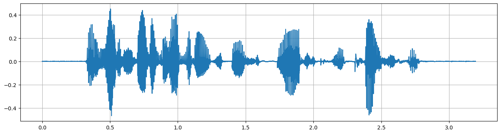
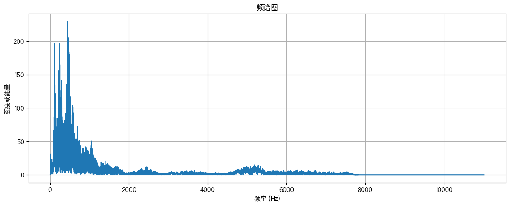
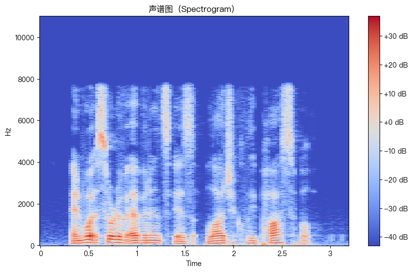
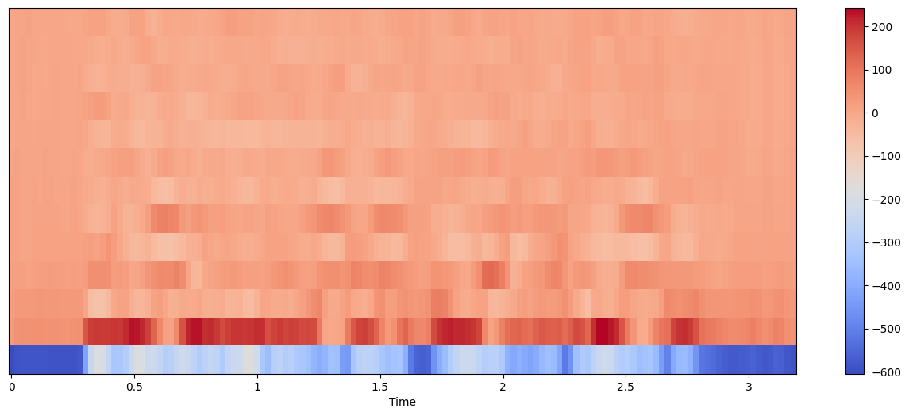

1

# 1 作业目标

- 任务：目标是探索MLP在语音识别中的应用，重点是音素状态的分类。

- 数据集：提供了梅尔频谱图形式的语音数据，训练数据包含相应的音素，需要训练一个MLP来预测这些音素状态。
- 主要目的：通过建立MLP，增强对神经网络的了解，并通过参数和超参数调整来提高模型的泛化和预测能力。

具体学习内容：

1. 使用MLP解决中等规模的分类问题：
   - 设置MLP
   - 处理数据
   - 训练模型
   - 优化模型

2. 探索最优解决方案的架构和超参数：
   - 识别并记录影响解决方案的设计/架构选择、参数和超参数
   - 搜索这些选项以找到最佳解决方案的策略

3. 分阶段进行探索过程：
   - 最初设置一个易于实现和优化的简单解决方案
   - 在训练数据的子样本上工作，以高效搜索解决方案
   - 跟踪验证数据上的损失和性能，确保代码正确运行且模型正确训练
   - 选择有前途的配置/设置，并在更大的（完整）数据集上评估这些配置

4. 使用PyTorch工具来工程化解决方案：
   - 处理数据加载、内存使用、算术精度等问题，以最大化时间效率和推断

# 2 作业清单

建议一步步按顺序完全如下清单内容：

1. 开始：
   - [ ] 完成测验-0
   
   - [x] 下载起始笔记本并设置虚拟环境（可选）
   
   - [x] 安装Kaggle API并创建一个目录
   - [x] 从Kaggle下载数据集.npz文件
   
2. 完成AudioDataset类：
   - [ ] 如果需要，修订DataLoaders和OOP，参考附录
   - [ ] 在`__init__()`中定义标签索引映射
   - [ ] 将数据索引映射、长度、上下文和偏移量分配给self
   - [ ] 根据上下文大小需要对数据进行零填充
   - [ ] 使用偏移量和上下文在`__getitem__()`中计算起始和结束时间步
   - [ ] 返回在索引处带有上下文和相应音素标签的重塑帧

3. 完成训练循环train.model()：
   - [ ] 完成训练数据集的数据加载器
   - [ ] 将模型设置为“训练模式”
   - [ ] 清除梯度
   - [ ] 计算模型输出和损失
   - [ ] 完成反向传播
   - [ ] 更新模型权重

4. 完成推理循环evaluate.model()：
   - [ ] 将模型设置为“评估模式”并创建验证集数据加载器
   - [ ] 在“无梯度”模式下计算模型输出
   - [ ] 使用模型输出计算验证损失
   - [ ] 从模型输出中获取最可能的音素作为预测
   - [ ] 计算验证准确率

5. 超参数调整：
   - [ ] 在早期提交截止日期前进行初始提交
   - [ ] 使用Weights and Biases记录每个时期的指标
   - [ ] 确保模型每隔几个时期就保存一次
   - [ ] 尝试更改第10节中列出的参数以改善结果
   - [ ] 如果你需要帮助，请参加办公时间 :)

# 3 语音基本概念

## 3.1 **音色**

又称为音质，是一种声音区别于另一种声音的基本特性。与人声带的振动频率、发音器官的送气方式和声道的形状、尺寸密切相关（由不同频率成分的组合和强度决定）

## 3.2 **音调**

声音的高低，取决于声波的频率（由采样捕捉到的频率变化决定）

下面是一些常见动物能够听到的声音频率范围：

1. **人类**：20-20000赫兹（20kHz）。年龄和听力健康状况会影响这个范围。
2. **狗**：40-60000赫兹。狗能听到比人类高得多的频率，这就是为什么狗可以听到一些对人类来说是超声波的哨声。
3. **猫**：48-85000赫兹。猫的听觉比狗还要敏感，特别是在高频范围内。
4. **蝙蝠**：1000-120000赫兹。蝙蝠依赖超声波进行回声定位。

## 3.3 **音强**

声音的强弱，它由声波的振动幅度所决定;

### 3.3.1 **关于振幅的单位**

在数字音频处理中，音频信号的振幅值通常没有特定的物理单位，因为它们表示的是声音波形的数字化样本。这些振幅值是原始模拟声音信号的量化表示，其大小取决于声音录制或处理时使用的比特深度（bit depth）。

- **比特深度**：这是每个音频样本的位数。常见的比特深度包括16位、24位或32位。比特深度越高，音频的动态范围越大，能够更精确地表示声音的细微差别。
- **归一化的值**：在许多音频处理软件和库（如`librosa`）中，振幅值常常被归一化。例如，对于16位音频，原始的振幅值可能在-32768到32767之间，但在处理时，这些值会被归一化到-1.0到1.0之间。这意味着，不论实际的比特深度是多少，振幅值都会被调整到这个标准范围内，使得处理更加一致。
- **物理意义**：尽管数字振幅值本身没有直接的物理单位，但它们与实际声音的压力波形有对应关系。较大的振幅值对应于声波的较高压力水平，通常我们会感知为更响的声音。

### 3.3.2 **关于分贝**

分贝（dB）是一个对数单位，用于描述幅度的相对水平。幅度转换为分贝单位的过程，实质上是一种将振幅值转换为更符合人耳感知的形式的过程。

人类的听觉感知对声音的强度是对数响应的，这意味着当声音的物理能量增加时，我们感知到的声音响度增加的速度要慢得多。分贝单位正是基于这种对数感知来量化声音响度的。具体来说，声音的响度（分贝值）计算公式通常如下：

$$ \text{分贝} = 20 \times \log_{10} \left( \frac{\text{信号幅度}}{\text{参考幅度}} \right) $$

其中，参考幅度通常是一个标准压力值（通常用于声音），或者是信号幅度中的最小值或平均值。

在分贝尺度上，即使是小的变化也可以被更容易地观察到，而在线性尺度上这些变化可能会不那么明显。

## 3.4 **音长**

声音的长短，取决于发音持续时间的长短;

### 3.4.1 **关于采样率**

- 采样是将连续的模拟音频信号转换为离散的数字信号的过程。
- 采样率（每秒的样本数），表示每秒钟从连续的音频信号中提取多少个样本。
- 例如，一个常见的采样率是44100 Hz，意味着每秒钟有44100个样本。
- 采样率越高，音频的质量通常越好。

### 3.4.2 为什么录音设备能够在极端时间完全记录声音的音调、音色、音强等

在极短的音频采样过程中，计算机能够完全记录声音的音调、音色、音强等属性，主要是因为现代数字音频技术采用了足够高的采样率和比特深度来准确捕捉声音的各种特性。这是通过两个关键的数字音频处理技术实现的：采样（Sampling）和量化（Quantization）。

1. **采样（Sampling）**:
   - 采样是将连续的模拟音频信号转换为离散的数字信号的过程。这是通过在规定的时间间隔内测量音频信号的振幅来完成的。
   - 采样率（Sampling Rate），即每秒采样次数，是这个过程的关键参数。根据奈奎斯特定理（Nyquist Theorem），为了准确捕捉到所有可听频率的音频信号，采样率应该至少是声音信号最高频率的两倍。对于人类听觉，这意味着采样率至少需要为40kHz。实际上，大多数音频系统使用44.1kHz或更高的采样率，足以捕捉到20kHz以下的所有听觉频率。
2. **量化（Quantization）**:
   - 量化是将采样得到的连续振幅值转换为离散值的过程。这是通过比特深度（Bit Depth）来控制的，比特深度越高，能够表示的振幅级别就越多，从而能更精确地表示声音的动态范围（从最安静到最响亮的声音）。
   - 例如，16位音频可以提供65,536（2^16^）个不同的振幅级别，而24位音频可以提供超过1600万（2^24^）个级别。

通过这两种技术，计算机可以在极短的时间内捕捉到声音的细微变化，包括音调（由采样捕捉到的频率变化决定）、音色（由不同频率成分的组合和强度决定）和音强（由振幅的大小决定）。因此，即使是极短的音频采样，只要采样率和比特深度足够高，计算机也能够完整地记录下声音的所有这些属性。

## 3.5 **语音信号的时域波形**、频谱图

“**And what sort of evidence is logically possible**”音频的时域波形图如下（音频持续3秒多）：

- 横轴表示时间（秒）
- 纵轴表示声音信号的振幅（已归一化）
- 采样率：22050 Hz，意味着每秒钟有22050个样本。

- **横轴（X轴）**：表示频率（Hz）。显示了音频信号中各个频率成分的范围。
- **纵轴（Y轴）**：表示幅度的大小。显示了音频信号中每个频率成分的强度或能量。
- 这张图是通过对音频信号进行快速傅里叶变换（FFT）来生成的。FFT将音频信号从时域转换到频域，结果展示了各个频率成分的幅度。

- 显示了音频信号中频率随时间的变化情况。
- **横轴（X轴）**：表示时间。
- **纵轴（Y轴）**：表示频率。
- 每个格子中的颜色强度表示在特定时间和频率下的信号幅度（转换成分贝表示）。

## 3.5 梅尔频率倒谱系数（MFCC）

MFCC（Mel Frequency Cepstral Coefficients，梅尔频率倒谱系数）是一种在语音和音频处理中广泛使用的特征表示方法。它们特别适用于语音识别和相关任务，因为它们能够有效地捕捉到语音信号的关键特性。以下是MFCC的完整介绍：

### 基本概念

1. **梅尔尺度（Mel Scale）**：
   - **梅尔尺度是基于人耳对不同频率声音敏感度的感知特性而设计的**。它是一种非线性的频率尺度，使得MFCC能够更贴近人类的听觉感知。
   - 低频下，梅尔尺度与线性频率尺度类似，但在高频时，梅尔尺度增长得更缓慢。

2. **倒谱（Cepstrum）**：
   - 倒谱是一种信号处理技术，通过对信号的频谱进行逆傅里叶变换来得到的。它有效地分离了信号中的周期性（谐波）和非周期性（如噪声）成分。

### 计算过程

MFCC的计算过程通常包括以下步骤：

1. **预加重**：
   - 对原始音频信号应用高通滤波，增强高频成分，模拟人耳对高频声音的敏感度。

2. **分帧和加窗**：
   - 将音频信号分割成小片段（帧），每帧一般在20-40毫秒之间。
   - 对每帧应用窗函数（如汉明窗），减少帧边界的不连续性。

3. **快速傅里叶变换（FFT）**：
   - 对每帧信号进行FFT，将其从时域转换到频域。

4. **梅尔滤波器组**：
   - 应用一组梅尔滤波器（通常是三角形滤波器组）到FFT结果上。这些滤波器覆盖了整个可听频率范围。
   - 通过梅尔滤波器组提取每帧的能量分布。

5. **对数能量**：
   - 对每个滤波器输出的能量取对数。这样做是为了模拟人耳对声音响度的感知（对数响应）。

6. **离散余弦变换（DCT）**：
   - 对梅尔滤波器组的对数能量输出应用DCT，从而得到最终的MFCC。
   - DCT有助于去除特征向量中的相关性，并产生更紧凑的特征表示。

### 应用

- **语音识别**：MFCC在自动语音识别系统中是一种标准的特征，因为它能够有效地表示语音的特性。
- **说话者识别**：MFCC也被用于识别不同的说话者，因为它可以捕捉个体的发音特征。
- **音频分类**：在音乐信息检索和情感分析等领域，MFCC也是一种重要的特征。

MFCC之所以有效，是因为它结合了人类的听觉感知特性和先进的信号处理技术，能够从原始音频信号中提取出有用的信息。

“**And what sort of evidence is logically possible**”音频的MFCC图如下（设定13个特征）：

**横轴**：时间轴。它表示音频的时间进程。由于MFCC是按音频帧计算的，因此横轴显示了整个音频信号的持续时间。每一列代表一个音频帧。本例MFCC划分为138个音频帧（每帧持续时间一般是20-40毫秒）。

**纵轴**：MFCC特征（或系数）。纵轴显示了计算出的13个MFCC特征，这些特征是从低到高排序的。每一行代表一个特定的MFCC特征。这些特性包括声音的总体能量（通常由第一个MFCC特征表示）、声音的频谱形状、声音的纹理等。不同的MFCC特征捕获了从低到高的不同频谱特性。较低序号的特征通常与音频信号的一般特性（如音调）相关，而较高序号的特征则与更细微的特性（如特定发音的细节）相关。

**颜色**：颜色的强度表示每个MFCC特征在每个时间点的大小或值，这提供了关于音频信号在那一瞬间的详细声学特性的信息。
