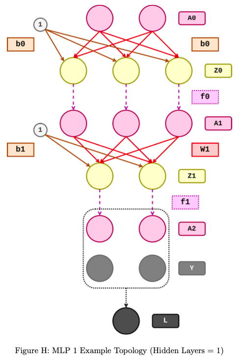
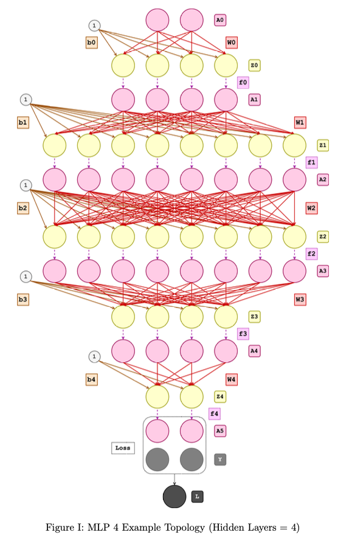
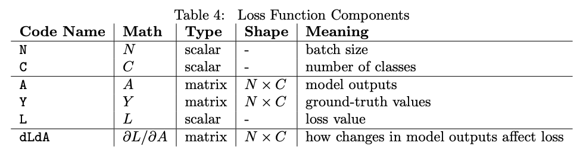
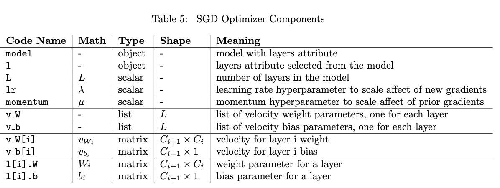
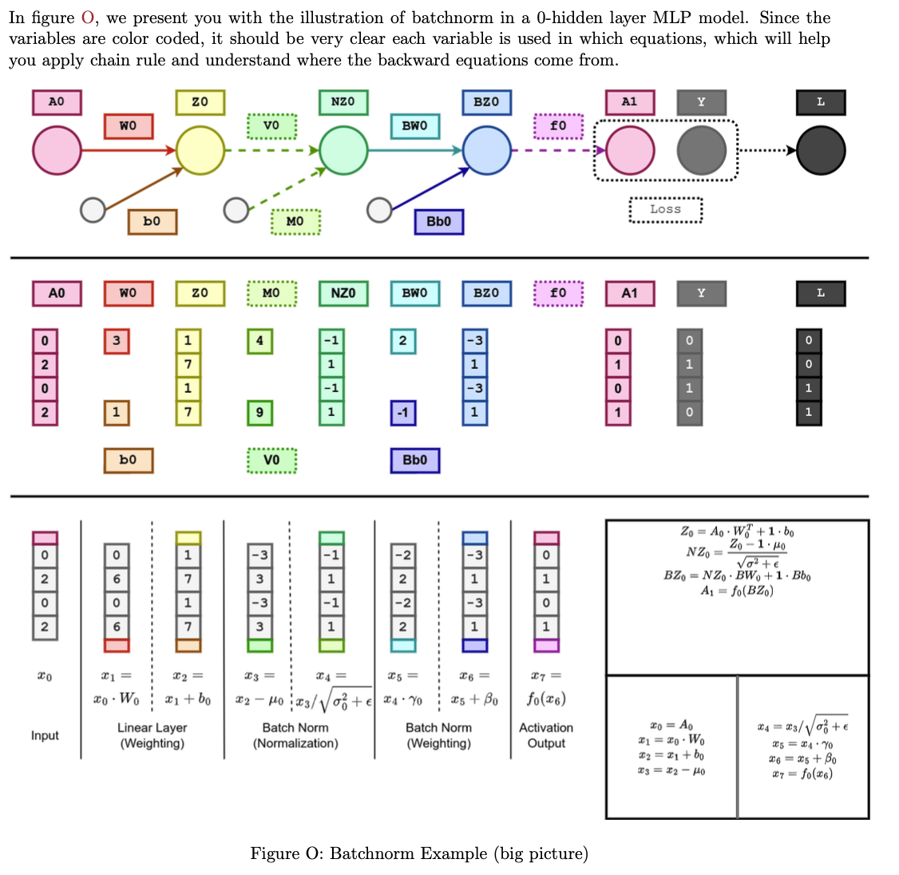
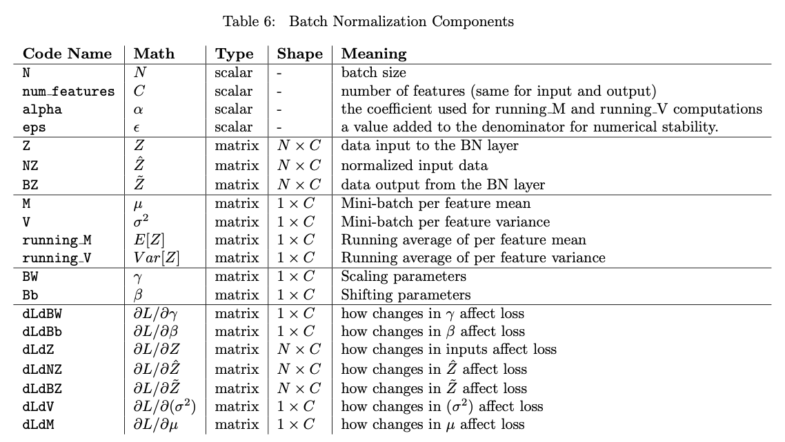

MLP

## 6.2节 - MLP（隐藏层 = 1）`[mytorch.models.MLP1]` [10]
在本节中任务是实现MLP1类的前向和反向属性函数。

MLP1的拓扑结构在图H中可视化。您需要使用该图来推断出模型特定的线性层。为了便于理解，您应该尝试给图进行标注，以显示哪些部分对应于哪些线性层和激活函数。



MLP1.forward() 的代码与 MLP0.forward() 非常相似，反向传播也是如此。

```Python
import numpy as np
from mytorch.nn.linear import Linear
from mytorch.nn.activation import ReLU

class MLP1:
    def __init__(self, debug=False):
        """
        初始化包含两个线性层的网络。第一层的形状为 (2,3)，第二层的形状为 (3,2)。
        两个线性层后都使用ReLU激活函数。
        类似于MLP0，将所有层按顺序存储在列表中。
        
        参数:
        - debug: 是否在前向和反向传播中保留中间结果以便于调试。
        """
        self.layers = [Linear(2, 3), ReLU(), Linear(3, 2), ReLU()]  # 定义线性层和激活层的列表
        self.debug = debug  # 调试标志

    def forward(self, A0):
        """
        交替通过线性层和相应的激活层传递输入，以获得模型的输出。
        
        参数:
        - A0: 输入数据
        
        返回:
        - A2: 模型的输出
        """
        Z0 = self.layers[0].forward(A0)  # 第一个线性层的前向传播
        A1 = self.layers[1].forward(Z0)  # 第一个激活层的前向传播
        
        Z1 = self.layers[2].forward(A1)  # 第二个线性层的前向传播
        A2 = self.layers[3].forward(Z1)  # 第二个激活层的前向传播
        
        # 如果处于调试模式，保留前向传播的中间结果
        if self.debug:
            self.Z0 = Z0
            self.A1 = A1
            self.Z1 = Z1
            self.A2 = A2

        return A2  # 返回模型的输出

    def backward(self, dLdA2):
        """
        参考文档中概述的伪代码，通过模型实现反向传播。
        
        参数:
        - dLdA2: 损失函数对模型最终输出的梯度
        
        返回:
        - dLdA0: 损失函数对模型输入的梯度
        """
        # 反向传播激活层和线性层
        dLdZ1 = self.layers[3].backward(dLdA2)  # 第二个激活层的反向传播
        dLdA1 = self.layers[2].backward(dLdZ1)  # 第二个线性层的反向传播
        
        dLdZ0 = self.layers[1].backward(dLdA1)  # 第一个激活层的反向传播
        dLdA0 = self.layers[0].backward(dLdZ0)  # 第一个线性层的反向传播
        
        # 如果处于调试模式，保留反向传播的中间结果
        if self.debug:
            self.dLdZ1 = dLdZ1
            self.dLdA1 = dLdA1
            self.dLdZ0 = dLdZ0
            self.dLdA0 = dLdA0

        return dLdA0  # 返回损失函数对模型输入的梯度
```

## 6.3 MLP (隐藏层 = 4) [mytorch.models.MLP4] [15]

实现如下结构的4层MLP：



```Python
import numpy as np

from mytorch.nn.linear import Linear
from mytorch.nn.activation import ReLU

class MLP4:
    def __init__(self, debug=False):
        self.layers = [
            Linear(2, 4), ReLU(),
            Linear(4, 8), ReLU(),
            Linear(8, 8), ReLU(),
            Linear(8, 4), ReLU(),
            Linear(4, 2), ReLU() 
        ]
        self.debug = debug  # 调试标志

    def forward(self, A):
        if self.debug:
            self.A = [A]  # 如果调试模式开启，记录输入

        # 逐层通过网络前向传播
        for layer in self.layers:
            A = layer.forward(A)  # 应用当前层的前向传播

            if self.debug:
                self.A.append(A)  # 如果调试模式开启，记录每一层的输出

        return A  # 返回模型的输出

    def backward(self, dLdA):
        if self.debug:
            self.dLdA = [dLdA]  # 如果调试模式开启，记录损失函数的梯度

        # 逐层通过网络反向传播
        for layer in reversed(self.layers):
            dLdA = layer.backward(dLdA)  # 应用当前层的反向传播

            if self.debug:
                self.dLdA.insert(0, dLdA)  # 如果调试模式开启，在列表前端插入每一层的梯度

        return dLdA  # 返回损失函数对模型输入的梯度
```


# 7 损失函数

编码实现均方误差损失函数（MSE Loss）和交叉熵损失函数（Cross Entropy Loss）。

您的任务是在文件loss.py中实现损失类的前向和后向属性函数：

- 类属性：
  - 存储模型预测A以计算反向传播。
  - 存储期望输出Y以计算反向传播。
- 类方法：
  - forward：前向方法接受模型预测A和期望输出Y，两者具有相同的形状来计算并返回损失值L。损失值是一个标量，用于量化网络输出和期望输出之间的不匹配。
  - backward：后向方法计算并返回dL/dA，即模型输出A变化如何影响损失L。它用于下游计算，如前几节所见。

请考虑以下类结构：

```Python
class Loss:
    def forward(self, A, Y):
        self.A = A
        self.Y = Y
        self.N = # TODO, 这是A和Y的第一维度
        self.C = # TODO, 这是A和Y的第二维度
        # TODO
        
        return L
        
    def backward(self):
        dLdA = # TODO
        
        return dLdA
```



## 7.1 MSE Loss [ mytorch.nn.MSELoss ]

均方误差（Mean Squared Error，简称MSE）是衡量模型预测值和实际观测值之间差异的一种常用方法。它在回归问题中特别常见，回归问题是指模型尝试预测连续值的任务，例如预测房价、温度、销售额等。

均方误差的计算公式如下：

$$MSE = \frac{1}{N} \sum_{i=1}^{N} (Y_i - \hat{Y}_i)^2$$

其中：
- $ N $ 是样本数量。
- $Y_i $是第$ i $个观测值。
- $ \hat{Y}_i $ 是第 $ i $ 个预测值。

在这个公式中，$Y_i $ 和  $\hat{Y}_i  $之间的差异被称为误差（error）。我们对每个样本的误差进行平方，这样做有几个理由：
- 平方确保了所有的误差都是正值，因为负数的平方是正数。
- 平方放大了较大误差的影响，这意味着较大的误差对总MSE的贡献更大。

总MSE是所有单个平方误差的平均值，给出了关于模型预测精度的整体度量。值越小，表示模型的预测值与实际值之间的差异越小，模型的性能越好。

在神经网络的训练过程中，MSE也常用作损失函数，用于优化模型参数。通过最小化MSE，可以使模型预

测的结果更加接近真实值。在训练神经网络时，MSE损失会计算每个输出节点的误差，将它们平方，然后计算平均值。然后，通过反向传播算法（Backpropagation）来调整模型权重，以减少损失值。

**优点：**

- **易于理解和实现：**MSE提供了一个清晰的度量，直观地表示了预测值与实际值之间的平均平方差距。
- **处罚较大的误差：**由于误差项是平方的，这意味着较大的误差对总损失的贡献比小误差大得多，这有助于模型识别并纠正那些有着较大误差的预测。
- **可微性：**MSE损失函数是可微的，这意味着我们可以用标准的梯度下降法等优化算法来最小化它，这是训练大多数类型的神经网络的基础。

**缺点：**
- **对异常值敏感：**由于平方项的影响，MSE对异常值非常敏感。这意味着，如果数据中存在离群点，它们将对总损失有很大影响，有时会导致模型偏向这些异常值。
- **可能导致过拟合：**在某些情况下，尤其是当模型非常复杂时，最小化MSE可能会导致过拟合，即模型在训练数据上表现很好，但在未见过的数据上表现不佳。

在实践中，可能会使用MSE的变体或其他损失函数来解决这些问题，例如均方根误差（RMSE）或平均绝对误差（MAE），或者在损失函数中添加正则化项来减轻过拟合的风险。

#### 7.1.1 MSE损失前向传播方程

给定模型的预测输出 $$ A $$ 和实际的标签 $$ Y $$，对于每个样本 $$ i $$ 和每个输出类别 $$ j $$，均方误差可以被定义为：

$$MSE = \frac{1}{N \times C} \sum_{i=1}^{N} \sum_{j=1}^{C} (A_{ij} - Y_{ij})^2 $$

其中：

- $$ N $$ 是样本数量。
- $$ C $$ 是每个样本的类别数量或输出的维度。

这个公式中，我们首先计算预测值 $$ A $$ 和实际值 $$ Y $$ 之间差的平方，然后对所有的样本和类别求和，最后除以样本数 $$ N $$ 和类别数 $$ C $$ 来得到均值。

#### 7.1.2 MSE损失反向传播方程

在反向传播中，我们需要计算损失函数相对于模型输出 $$ A $$ 的梯度，即 $$ \frac{\partial MSE}{\partial A} $$。

由于均方误差是对预测误差平方的平均值，我们可以根据链式法则对 $$ A $$ 的每个元素 $$ A_{ij} $$ 计算偏导数：

$$ \frac{\partial MSE}{\partial A_{ij}} = \frac{2}{N \times C} (A_{ij} - Y_{ij}) $$

这里我们利用了以下导数规则：

- $$ (x^2)' = 2x $$ 的导数是 $$ 2x $$。
- 平均值的导数是每个项的导数除以项的数量。

因此，对于整个输出矩阵 $$ A $$，其梯度 $$ dLdA $$ 为：

$$ dLdA = \frac{2}{N \times C} (A - Y) $$

### 7.1.3 numpy实现

```Python
import numpy as np

class MSELoss:

    def forward(self, A, Y):
        """
        Calculate the Mean Squared Error (MSE) loss
        :param A: Output of the model of shape (N, C)
        :param Y: Ground-truth values of shape (N, C)
        :Return: MSE Loss (scalar)
        """
        self.A = A
        self.Y = Y
        self.N, self.C = A.shape  
        
        # 计算平方误差
        se = (A - Y) ** 2
        # 计算所有平方误差的和
        sse = np.sum(se)
        # 计算均方误差
        mse = sse / (self.N * self.C)
        
        return mse

    def backward(self):
        """
        Compute the gradient of the loss with respect to the model output A
        :Return: Gradient of the loss with respect to A
        """
        # 计算MSE损失对A的梯度
        dLdA = 2 * (self.A - self.Y) / (self.N * self.C)
        
        return dLdA

```


### 7.2 交叉熵损失 [torch.nn.CrossEntropyLoss]

交叉熵损失函数（Cross-Entropy Loss Function），也称为对数损失（Log Loss），是用于分类问题的一种常用损失函数，特别是在二分类和多分类的神经网络模型中。

对于二分类问题，交叉熵损失函数的数学表达式为：

$$L = -\frac{1}{N} \sum_{i=1}^{N} [y_i \log(p_i) + (1 - y_i) \log(1 - p_i)] $$

其中：
- $$ N $$ 是样本数量。
- $$ y_i $$ 是第 $$ i $$ 个样本的真实标签，通常是0或1。
- $$ p_i $$ 是模型预测第 $$ i $$ 个样本为正类的概率。

对于多分类问题，交叉熵损失扩展为：

$$L = -\frac{1}{N} \sum_{i=1}^{N} \sum_{c=1}^{C} y_{ic} \log(p_{ic}) $$

其中：
- $$ C $$ 是类别总数。
- $$ y_{ic} $$ 是一个独热编码的向量，表示第 $$ i $$ 个样本是否属于类别 $$ c $$。
- $$ p_{ic} $$ 是模型预测第 $$ i $$ 个样本属于类别 $$ c $$ 的概率。

交叉熵损失函数的主要优点包括：

1. **概率解释：** 它直接与模型输出的概率分布相关联，提供了模型预测与实际分布差异的概率解释。
2. **梯度特性：** 它为每个类别提供了不同的梯度值，这有助于模型在学习过程中区分不同类别。
3. **与信息论的联系：** 交叉熵来源于信息论，量化了两个概率分布之间的差异，即模型预测的分布与实际分布。

使用交叉熵作为损失函数时，优化算法（如梯度下降）会调整模型参数，以最小化预测概率分布与真实概率分布之间的差异。这促使模型更准确地预测每个类别的概率。由于交叉熵反应了预测概率分布的准确性，因此它在处理分类问题时是一个强大的工具。

### 7.2.1 前向传播推导

给定模型的原始输出 $$ A $$ 和真实的标签 $$ Y $$，在交叉熵损失函数的计算中，我们首先需要将原始输出转换为概率分布，这是通过 `softmax` 函数完成的。

对于每个样本 $$ i $$ 和每个类别 $$ j $$，softmax函数的计算如下：

$$ \sigma(A_{ij}) = \frac{e^{A_{ij}}}{\sum_{k=1}^{C} e^{A_{ik}}} $$

其中：
- $$ e^{A_{ij}} $$ 是输出 $$ A_{ij} $$ 的指数。
- 分母是对应样本 $$ i $$ 所有类别输出指数的总和，确保了 $$ \sigma(A_{ij}) $$ 的和为1，即概率分布。

交叉熵损失函数定义为：

$$ L = -\frac{1}{N} \sum_{i=1}^{N} \sum_{j=1}^{C} Y_{ij} \log(\sigma(A_{ij})) $$

这里：
- $$ N $$ 是样本数量。
- $$ C $$ 是类别数量。
- $$ Y_{ij} $$ 是一个独热编码的标签，如果样本 $$ i $$ 属于类别 $$ j $$，则 $$ Y_{ij} = 1 $$，否则 $$ Y_{ij} = 0 $$。

### 7.2.2 反向传播推导

在反向传播中，我们需要计算交叉熵损失相对于模型原始输出 $$ A $$ 的梯度，即 $$ \frac{\partial L}{\partial A} $$。

由于真实标签 $$ Y $$ 是独热编码的，对于每个样本 $$ i $$ 和每个类别 $$ j $$，损失函数 $$ L $$ 关于 $$ A_{ij} $$ 的偏导数可以简化为：

$$ \frac{\partial L}{\partial A_{ij}} = \sigma(A_{ij}) - Y_{ij} $$

因此，对于整个输出矩阵 $$ A $$，其梯度 $$ dLdA $$ 为：

$$ dLdA = \frac{1}{N} (\sigma(A) - Y) $$

### 7.2.3 numpy实现

```Python
import numpy as np

class CrossEntropyLoss:

    def softmax(self, x):
        """
        计算softmax概率分布。
        :param x: 输入数组。
        :return: softmax概率分布。
        """
        # 防止指数运算溢出，通过减去每一行的最大值来进行数值稳定化
        x = x - np.max(x, axis=1, keepdims=True)
        exps = np.exp(x)
        return exps / np.sum(exps, axis=1, keepdims=True)

    def forward(self, A, Y):
        """
        计算交叉熵损失。
        :param A: 模型的输出，形状为(N, C)，其中N是样本数量，C是类别数。
        :param Y: 真实标签的独热编码，形状与A相同。
        :return: 交叉熵损失的标量值。
        """
        self.A = A
        self.Y = Y
        N, C = A.shape  # N是样本数量，C是类别数

        # 计算softmax概率分布
        self.softmax = self.softmax(A)
        # 计算交叉熵
        crossentropy = -np.sum(Y * np.log(self.softmax + 1e-15))  # 加上小数1e-15防止对数为负无穷
        # 计算平均交叉熵损失
        L = crossentropy / N

        return L

    def backward(self):
        """
        计算损失关于模型输出的梯度。
        :return: 损失关于A的梯度。
        """
        N = self.Y.shape[0]  # N是样本数量
        # 计算交叉熵损失对A的梯度
        dLdA = (self.softmax - self.Y) / N

        return dLdA

```


# 8 优化器 [10]

在机器学习和深度学习中，优化器是用于更新和计算模型内部参数以最小化损失函数的算法。损失函数衡量的是模型预测值与实际值之间的差异，优化器的目的是找到能够使这个损失最小化的参数值。

优化器的种类很多，但它们都是为了解决这样一个问题：找到损失函数的最小值，即在可能的参数空间中寻找一组参数，使得损失函数值最小。在深度学习中，这个问题通常是非凸的，意味着可能存在多个局部最小值。因此，优化算法不仅要找到一个最小值，还要尽量找到全局最小值，或者至少是一个“好的”局部最小值。

下面是一些常见的优化算法：

1. **梯度下降（Gradient Descent）**：最基础的优化方法，通过计算损失函数关于参数的梯度，并朝着梯度的反方向更新参数，直到找到最小值。

2. **随机梯度下降（Stochastic Gradient Descent, SGD）**：梯度下降的变种，不是在整个数据集上计算梯度，而是在每次迭代中随机选择一个样本或一小批样本来计算梯度，这样可以加快计算速度。

3. **带动量的SGD（Momentum SGD）**：在SGD的基础上增加了动量项，可以视为对参数更新的“惯性”，有助于加速SGD在正确方向上的收敛，同时减少振荡。

4. **自适应学习率优化器**：
   - **Adagrad**：调整学习率以便对于出现频率较低的特征给予更大的更新。
   - **RMSprop**：修改Adagrad以解决其学习率不断减小的问题。
   - **Adam**：结合了Momentum和RMSprop的优点。

优化器的选择取决于具体问题、模型的复杂性以及数据的特征。通常，带动量的优化器或自适应学习率优化器在训练深度神经网络时更为有效。优化算法的研究仍然是机器学习领域中非常活跃的一个研究方向。

## 8.1 随机梯度下降 (SGD) [ mytorch.optim.SGD ]

随机梯度下降（Stochastic Gradient Descent，SGD）是深度学习中常用的优化算法，用于更新神经网络中的权重参数，以最小化损失函数。SGD的核心思想是，每次更新参数时，不是使用全部数据计算梯度（这在大数据集上非常耗时），而是随机选取一个样本（或一小批样本）来估计梯度，并用这个估计值来更新参数。

### 8.1.1 SGD的基本形式

基本的SGD更新规则非常简单，对于每个参数 $$ W $$（权重）和 $$ b $$（偏置），更新规则如下：

$$ W := W - \lambda \frac{\partial L}{\partial W} $$
$$ b := b - \lambda \frac{\partial L}{\partial b} $$

其中 $$ \lambda $$ 是学习率，决定了每一步更新的大小；$$ \frac{\partial L}{\partial W} $$ 和 $$ \frac{\partial L}{\partial b} $$ 是当前参数下损失函数 $$ L $$ 关于权重和偏置的梯度。

### 8.1.2 SGD带动量（Momentum）

SGD带动量（Momentum）是对传统随机梯度下降的改进，它旨在加速学习过程，尤其是对于高曲率、小但一致的梯度或带有噪声的梯度的情况非常有效。

在没有动量的情况下，参数 $$ W $$（权重）和 $$ b $$（偏置）的更新规则是基于当前的梯度：

$$ W := W - \lambda \frac{\partial L}{\partial W} $$
$$ b := b - \lambda \frac{\partial L}{\partial b} $$

其中 $$ \lambda $$ 是学习率，$$ \frac{\partial L}{\partial W} $$ 和 $$ \frac{\partial L}{\partial b} $$ 是损失函数 $$ L $$ 关于权重 $$ W $$ 和偏置 $$ b $$ 的梯度。

在带动量的SGD中，更新规则添加了前一时间步的更新向量，即“动量”，这个动量不仅考虑了当前的梯度，还考虑了之前梯度的方向和大小。公式如下：

1. 首先，计算动量项 $$ v $$，它是当前梯度和之前动量项的线性组合：

$$ v_W := \mu v_W + \frac{\partial L}{\partial W} $$
$$ v_b := \mu v_b + \frac{\partial L}{\partial b} $$

其中 $$ \mu $$（通常取值在0和1之间）是动量系数，它决定了前一时间步更新向量 $$ v $$ 对当前更新的贡献程度。如果 $$ \mu $$ 为0，那么SGD带动量就退化成了普通的SGD。

2. 然后，使用动量项 $$ v $$ 来更新参数：

$$ W := W - \lambda v_W $$
$$ b := b - \lambda v_b $$

在这里，动量项 $$ v_W $$ 和 $$ v_b $$ 相当于加权移动平均的梯度，它不仅包含了当前的梯度信息，还累积了之前的梯度信息，从而在参数空间中创建了一种惯性效果。这有助于参数更新在稳定方向上更加平滑，并且有助于跨越局部最小值和鞍点。

简而言之，动量项使得参数更新不仅受到当前梯度的影响，还受到历史梯度的影响，这样可以平滑震荡和加速收敛。在实践中，使用动量通常可以达到更快的收敛速度，并有助于避免陷入局部最小值。

### 8.1.3 numpy实现



- 类属性：
  - `l`: 模型层的列表
  - `L`: 模型层的数量
  - `lr`: 学习率，可调的超参数，用于调整更新的大小
  - `mu`: 动量μ，可调的超参数，控制以前更新影响当前更新的程度。μ = 0表示无动量。
  - `v_w`: 每一层的权重速度列表
  - `v_b`: 每一层的偏置速度列表
- 类方法：
  - `step`: 更新模型层的W和b：
    - 因为参数梯度告诉我们哪个方向使模型变得更糟，我们向相反的方向移动梯度来更新参数。
    - 当动量不为零时，更新速度v_w和v_b，它们是梯度变化的方向，有助于到达全局最小值。先前更新的速度通过超参数μ来缩放。

```Python
import numpy as np

class SGD:

    def __init__(self, model, lr=0.1, momentum=0):
        # 初始化存储模型层、学习率和动量
        self.l = model.layers
        self.L = len(model.layers)
        self.lr = lr
        self.mu = momentum
        # 初始化权重和偏置的速度变量
        self.v_W = [np.zeros(layer.W.shape, dtype="f") for layer in self.l]
        self.v_b = [np.zeros(layer.b.shape, dtype="f") for layer in self.l]

    def step(self):
        # 对每层进行参数更新
        for i in range(self.L):
            if self.mu == 0:
                # 如果动量为0，使用标准的SGD更新
                self.l[i].W -= self.lr * self.l[i].dLdW
                self.l[i].b -= self.lr * self.l[i].dLdb
            else:
                # 如果使用动量，更新速度变量
                self.v_W[i] = self.mu * self.v_W[i] + self.l[i].dLdW
                self.v_b[i] = self.mu * self.v_b[i] + self.l[i].dLdb
                # 使用速度变量进行参数更新
                self.l[i].W -= self.lr * self.v_W[i]
                self.l[i].b -= self.lr * self.v_b[i]

```


# 9 正则化 [20]

正则化是机器学习和统计学中常用的一种技术，旨在减少模型的过拟合，提高模型的泛化能力。过拟合指的是模型在训练数据上表现得很好，但在未知数据上表现不佳。正则化通过引入额外的信息或约束来抑制模型的复杂度。

## 9.1 批量归一化 [torch.nn.BatchNorm1d]

关于BN层介绍，见OneNote笔记《模块：BN 、LN、IN、GN标准化》。

### 9.1.1 前向传播训练公式（`eval=False`）

在训练模式下，对于输入的数据 $Z \in \mathbb{R}^{N \times D}$（其中 $N$ 是批次大小，$D$ 是特征的维度），BN 层会计算每个特征的均值 $\mu$ 和方差 $\sigma^2$，然后使用这些参数进行归一化，最后应用可学习的参数进行缩放和位移。

1. **计算均值**：
    $$ \mu_B = \frac{1}{N} \sum_{i=1}^{N} Z_i $$

  这是每个特征在当前批次中所有样本的平均值。

2. **计算方差**：
    $$ \sigma^2_B = \frac{1}{N} \sum_{i=1}^{N} (Z_i - \mu_B)^2 $$

  这是每个特征在当前批次中所有样本的方差。

3. **归一化**：
    $$ \hat{Z}_i = \frac{Z_i - \mu_B}{\sqrt{\sigma^2_B + \epsilon}} $$

4. **缩放和位移**：
    $$ Y_i = \gamma \hat{Z}_i + \beta $$

其中，$Y_i$ 是 BN 层的输出，$\gamma$ 是缩放参数（对应代码中的 `self.BW`），$\beta$ 是位移参数（对应代码中的 `self.Bb`），$\epsilon$ 是一个很小的常数，防止除以零。

### 9.1.2 前向传播推理公式（`eval=True`）

在推理模式下，我们使用在训练过程中计算得到的运行时均值和方差来进行归一化。

1. **归一化**：
$$ \hat{Z}_i = \frac{Z_i - \mu_{\text{running}}}{\sqrt{\sigma^2_{\text{running}} + \epsilon}} $$

2. **缩放和位移**（同训练模式）：
$$ Y_i = \gamma \hat{Z}_i + \beta $$

其中 $\mu_{\text{running}}$ 和 $\sigma^2_{\text{running}}$ 分别是在训练期间计算的运行时均值和方差。

在批量归一化（Batch Normalization）过程中，运行时均值（$\mu_{\text{running}}$）和运行时方差（$\sigma^2_{\text{running}}$）通常是通过指数加权移动平均（Exponential Moving Average，EMA）来更新的。更新公式如下：

1. **运行时均值的更新公式**：
$$ \mu_{\text{running}} = \alpha \cdot \mu_{\text{running}} + (1 - \alpha) \cdot \mu_{\text{batch}} $$

2. **运行时方差的更新公式**：
$$ \sigma^2_{\text{running}} = \alpha \cdot \sigma^2_{\text{running}} + (1 - \alpha) \cdot \sigma^2_{\text{batch}} $$

这里的 $\mu_{\text{batch}}$ 和 $\sigma^2_{\text{batch}}$ 分别是当前批次数据的均值和方差。$\alpha$ 是一个介于 0 和 1 之间的超参数，称为衰减系数（decay factor），它决定了历史统计信息的权重。当 $\alpha$ 接近1时，历史统计信息的权重更大，更新速度变慢；当 $\alpha$ 较小，新批次数据的影响更大。

在实际应用中，$\mu_{\text{running}}$ 和 $\sigma^2_{\text{running}}$ 通常在每个训练批次后更新，并用于模型的推理阶段。这样可以确保模型在推理时使用的是整个训练数据的全局统计信息，而不是仅仅依赖于单个批次的局部统计信息。

### 9.1.3 反向传播公式

在BN层的反向传播过程中，我们需要计算3部分梯度：

- 损失函数 $L$ 关于原始输入$Z$的梯度：用于继续往前传递梯度。
- 损失函数 $L$ 关于缩放参数 $\gamma$ 和位移参数 $\beta$ 的梯度：用于更新$\gamma$ 和$\beta$ 的值。

1. **关于 $\beta$ 的梯度**：
   
    BN层的前向传播公式如下：
    
    $$ Y_i = \gamma \hat{Z}_i + \beta $$
    
    这里：
    - $$ Y_i $$ 是 BN 层输出的第 $$ i $$ 个样本值。
    - $$ \hat{Z}_i $$ 是归一化后的第 $$ i $$ 个样本值。
    - $$ \gamma $$ 是缩放因子。
    - $$ \beta $$ 是位移项。
    
    我们需要计算损失函数 $$ L $$ （**注意这个loss是整个batch的总loss**）相对于 $$ \beta $$ 的梯度，记为 $$ \frac{\partial L}{\partial \beta} $$。
    
    考虑到 $$ \beta $$ 是一个标量，并且直接加到每个归一化后的样本 $$ \hat{Z}_i $$ 上，我们可以将损失函数 $$ L $$ 相对于 $$ \beta $$ 的梯度看作是损失函数 $$ L $$ 相对于 BN 层输出 $$ Y $$ 的梯度 $$ \frac{\partial L}{\partial Y} $$ 的和。
    
    根据链式法则：
    
    $$ \frac{\partial L}{\partial \beta} = \sum_{i=1}^{N} \frac{\partial L}{\partial Y_i} \cdot \frac{\partial Y_i}{\partial \beta} $$
    
    由于 $$ Y_i = \gamma \hat{Z}_i + \beta $$，$$ \beta $$ 对每个样本的影响是相同的，即对于任何 $$ i $$：
    
    $$ \frac{\partial Y_i}{\partial \beta} = 1 $$
    
    因此，损失函数 $$ L $$ 相对于 $$ \beta $$ 的梯度就是对所有样本的 $$ \frac{\partial L}{\partial Y_i} $$ 的和：
    
    $$ \frac{\partial L}{\partial \beta} = \sum_{i=1}^{N} \frac{\partial L}{\partial Y_i} $$
    
    其中 $N$ 是批次中的样本数量，$Y_i$ 是 BN 层输出的第 $i$ 个样本值。

2. **关于 $\gamma$ 的梯度**：
    $$ \frac{\partial L}{\partial \gamma} = \sum_{i=1}^{N} \frac{\partial L}{\partial Y_i} \hat{Z}_i $$

  	同理，这里 $$ \hat{Z}_i $$ 是 $$ \gamma $$ 乘以的对象，所以 $$ \gamma $$ 的梯度是 $$ \frac{\partial L}{\partial Y_i} $$ 和 $$ \hat{Z}_i $$ 的乘积的和。

3. **关于 $Z_i$ 的梯度**，这是最复杂的部分，需要应用链式法则和一些微积分运算：
     $$ \frac{\partial L}{\partial Z_i} = \frac{\partial L}{\partial \hat{Z}_i}   \frac{\partial \hat{Z}_i}{\partial Z_i} + \frac{\partial L}{\partial \sigma^2} \frac{\partial \sigma^2}{\partial Z_i} + \frac{\partial L}{\partial \mu} \frac{\partial \mu}{\partial Z_i} = \frac{\partial L}{\partial \hat{Z}_i} \frac{1}{\sqrt{\sigma^2_B + \epsilon}} + \frac{\partial L}{\partial \sigma^2_B} \frac{2(Z_i - \mu_B)}{N} + \frac{\partial L}{\partial \mu_B} \frac{1}{N} $$

​	其中：

​	$$ \frac{\partial L}{\partial \hat{Z}_i} = \frac{\partial L}{\partial Y_i} \frac{\partial Y_i}{\partial \hat{Z}_i} =\frac{\partial L}{\partial Y_i} \gamma $$

​	$$ \frac{\partial L}{\partial \sigma^2_B} = \sum_{i=1}^{N} \frac{\partial L}{\partial \hat{Z}_i} (\hat{Z}_i - \mu_B) (-\frac{1}{2}) (\sigma^2_B + \epsilon)^{-\frac{3}{2}} $$

​	$$ \frac{\partial L}{\partial \mu_B} = \sum_{i=1}^{N} \frac{\partial L}{\partial \hat{Z}_i} (-\frac{1}{\sqrt{\sigma^2_B + \epsilon}}) + \frac{\partial L}{\partial \sigma^2_B} \frac{\sum_{i=1}^{N} -2(Z_i - \mu_B)}{N} $$

**举例**：

假设我们有一个很简单的批次数据$$Z = [1, 2, 3] $$ 和$$\gamma = 2 $$、$$ \beta = 1 $$，损失函数关于$$Y $$ 的梯度$$G = [0.1, 0.2, 0.3] $$。计算过程如下：

1. 前向传播计算$$\mu $$、$$ \sigma^2 $$ 和$$\hat{Z} $$：
   - $$ \mu = \frac{1 + 2 + 3}{3} = 2 $$
   - $$ \sigma^2 = \frac{(1-2)^2 + (2-2)^2 + (3-2)^2}{3} = \frac{2}{3} $$
   
      - $$ \hat{Z} = \frac{Z - \mu}{\sqrt{\sigma^2 + \epsilon}} = [-1.2247, 0, 1.2247] $$（假设$$\epsilon $$ 很小）
   
2. 反向传播计算$$\frac{\partial L}{\partial Z} $$：
   - $$ \frac{\partial L}{\partial \beta} = 0.1 + 0.2 + 0.3 = 0.6 $$
   - $$ \frac{\partial L}{\partial \gamma} = 0.1 \cdot (-1.2247) + 0.2 \cdot 0 + 0.3 \cdot 1.2247 = 0.12247 $$
   - $$ \frac{\partial L}{\partial Z} $$ 的计算需要通过上面的公式，涉及到$$\frac{\partial L}{\partial \sigma^2} $$ 和$$\frac{\partial L}{\partial \mu} $$，这部分计算较为复杂。

举例：0个隐藏层的MLP模型中BN过程



（图中从左至右按顺序的方程及过程）

1. 输入层
$$ x_0 $$

2. 线性层（加权）
$$ x_1 = x_0 \cdot W_0 + b_0 $$

3. 批量归一化
$$ Z_0 = x_1 $$
$$ M_0 = \mu_0 $$（均值）
$$ V_0 = \sigma^2_0 $$（方差）
$$ NZ_0 = \frac{x_1 - \mu_0}{\sqrt{\sigma^2_0 + \epsilon}} $$（归一化）

4. 批量归一化（加权）
$$ BZ_0 = NZ_0 \cdot \gamma_0 + \beta_0 $$

5. 激活层
$$ A_1 = f(BZ_0) $$（激活函数输出）

6. 输出层
$$ Y $$

7. 损失
$$ L $$

### 9.1.4 numpy实现



```Python
import numpy as np


class BatchNorm1d:
    def __init__(self, num_features, alpha=0.9):
        """
        批量归一化层的初始化函数。
        
        :param num_features: 特征的数量
        :param alpha: 用于计算运行均值和方差的指数加权移动平均系数
        """
        self.alpha = alpha  # 指数加权移动平均的系数
        self.eps = 1e-8  # 防止除以零的小数值

        # 初始化可学习参数，缩放因子和位移项
        self.BW = np.ones((1, num_features))
        self.Bb = np.zeros((1, num_features))

        # 梯度初始化
        self.dLdBW = np.zeros((1, num_features))
        self.dLdBb = np.zeros((1, num_features))

        # 运行时均值和方差，训练时更新，推理时使用
        self.running_M = np.zeros((1, num_features))
        self.running_V = np.ones((1, num_features))

    def forward(self, Z, eval=False):
        """
        批量归一化层的前向传播函数。

        :param Z: 输入数据
        :param eval: 是否为推理模式
        :return: 归一化并缩放、位移后的数据
        """
        self.Z = Z  # 输入数据
        self.N = Z.shape[0]  # 数据批次大小

        if not eval:
            # 训练模式
            self.M = np.mean(Z, axis=0)  # 计算均值
            self.V = np.var(Z, axis=0)  # 计算方差
            
            # 更新运行时均值和方差
            self.running_M = self.alpha * self.running_M + (1 - self.alpha) * self.M
            self.running_V = self.alpha * self.running_V + (1 - self.alpha) * self.V

            # 归一化处理
            self.NZ = (Z - self.M) / np.sqrt(self.V + self.eps)
        else:
            # 推理模式
            self.NZ = (Z - self.running_M) / np.sqrt(self.running_V + self.eps)

        # 缩放和位移
        self.BZ = self.BW * self.NZ + self.Bb
        return self.BZ

    def backward(self, dLdBZ):
        """
        批量归一化层的后向传播函数。

        :param dLdBZ: 损失函数关于批量归一化后数据的梯度
        :return: 损失函数关于批量归一化前数据的梯度
        """
        # 计算可学习参数的梯度
        self.dLdBW = np.sum(dLdBZ * self.NZ, axis=0, keepdims=True)
        self.dLdBb = np.sum(dLdBZ, axis=0, keepdims=True)
        
        # 计算传递给前一层的梯度
        dLdNZ = dLdBZ * self.BW
        dLdV = np.sum(dLdNZ * (self.Z - self.M) * -0.5 * (self.V + self.eps) ** (-3/2), axis=0, keepdims=True)
        dLdM = np.sum(dLdNZ * -1 / np.sqrt(self.V + self.eps), axis=0, keepdims=True) + \
               dLdV * np.mean(-2 * (self.Z - self.M), axis=0, keepdims=True)
        
        # 归一化前数据的梯度
        dLdZ = dLdNZ / np.sqrt(self.V + self.eps) + \
               dLdV * 2 * (self.Z - self.M) / self.N + \
               dLdM / self.N

        return dLdZ

```


